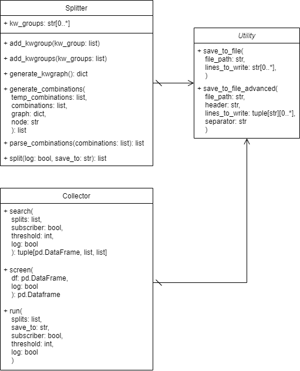

# prisma-automator
Automates the initial steps of the PRISMA statement: split-string generation, article search, search result screening, and data saving to an Excel sheet for further analysis.

- [Requirements](#requirements)
- [Quickstart](#quickstart)
  - [Environment](#environment)
  - [Elsevier API Key](#elsevier-api-key)
  - [Keyword groups](#keyword-groups)
- [Detailed Explanation](#detailed-explanation)
  - [Splitter](#splitter)
  - [Collector](#collector)
  - [Use case](#use-case)
  - [Test suite](#test-suite)
- [Limitations](#limitations)

## Requirements
- Python 3.x

**Note:** package developed with Python 3.9.1

## Quickstart
### Environment
If familiar with virtual environments:
```sh
python -m venv .env
./.env/Scripts/Activate
python -m pip install -r requirements.txt
```

If using Anaconda:
```sh
conda env create -f environment.yml
conda activate prisma-automator
conda env list
```
**Note:** The last line is for verifying if the environment was created successfully. The environment name `prisma-automator` can be changed in the `environment.yml` file.

### Elsevier API Key

Follow instructions in [Pybliometrics: How to access Scopus](https://pybliometrics.readthedocs.io/en/stable/access.html).

The first time you run `main.py`, it'll request your API key when it attempts to search Scopus. Follow the instructions in the console.

You can also change your key by editing `APIKey` in `C:\Users\<YOU>\.pybliometrics\config.ini` under `[Authentication]`.

### Keyword groups

Open `main.py`, look for a section named ` """ Split string generation """` and `# Create keyword groups`. Edit/add/delete keyword group variables to your liking.

After setting your keyword groups, run
```sh
python main.py
```

For an example and more details about keyword groups, see [Use case](#use-case).

## Detailed Explanation

The project contains two main classes: `Splitter` and `Collector`.

The `Splitter` class is responsible for generating all possible search strings (splits) from the defined keyword groups.

The `Collector` class is responsible for interacting with the Scopus API and retrieving results, as well as cleaning them up before saving them to a local directory.

Both classes come with methods to wrap all of their functionality and streamline the process of acquiring search strings and Scopus results. Nonetheless, it's also possible to use the other methods and alter the default functionality to suit any particular needs.

`Splitter` has the `split()` method, and `Collector` has the `run()` method. Start by looking into these if you want to understand how everything works.

The following class diagram presents an overview of the system:



### Splitter
The `Splitter` class uses a recursive depth-first search to generate all possible keyword combinations. Before that, it's necessary to generate an adjacency graph to represent the tree. The generated combinations are then parsed to generate splits that are searchable in Scopus.
- `add_kwgroup()` and `add_kwgroups()`: add keyword groups to the Splitter. These keyword groups are then used in generating combinations and splits;
- `generate_kwgraph()`: generates an adjacency graph from the added keywords for use in depth-first search;
- `generate_combinations()`: uses recursive depth-first search to generate all possible keyword combinations;
- `parse_combinations()`: parses keyword combinations into searchable strings;
- `split()`: streamlines the split generation process by calling all other methods, as well as saving generated data to the local directory.

### Collector
The `Collector` class comes with 3 methods: `search()`, `screen()`, and `run()`.
- `search()`: takes the generated splits as input and searches Scopus. Results are saved in 3 different objects: a Pandas dataframe containing all data from search results (doi, title, etc.), and two lists containing the number of search results and their associated split;
- `screen()`: takes the generated dataframe as input and screens it for duplicates, unnecessary columns (e.g. funding data), conference reviews, and rows without a doi;
- `run()`: streamlines the whole process by calling `search()` and `screen()`, as well as saving the generated data to the local directory.

### Use case
Suppose you'd like to look for articles related to extended reality and its applications in brain-computer interfaces and gaming. You come up with the following keywords:
- Virtual Reality
- Augmented Reality
- Extended Reality
- Mixed Reality
- BCI
- Gaming

Then you wonder if Digital Twins are being used alongside these technologies, but it's an optional keyword. Suppose you come up with a search string that looks something like this:

```log
("Virtual Reality" OR "Augmented Reality" OR ("Extended Reality" OR "Mixed Reality")) AND ("BCI" OR "Gaming") AND "Digital Twin"
```

and the same search string, but without the `AND "Digital Twin"` part. Your keyword groups (separated by the `AND` operators) are:

```txt
Group 1 = "Virtual Reality" OR "Augmented Reality" OR ("Extended Reality" OR "Mixed Reality")
Group 2 = "BCI" OR "Gaming"
Group 3 = "Digital Twin"
```

As such, your keyword group variables can be defined as:

```py
group_1 = ["Virtual Reality", "Augmented Reality", "Extended Reality || Mixed Reality"]
group_2 = ["BCI", "Gaming"]
group_3 = ["Digital Twin", ""]
```

Note that `("Extended Reality" OR "Mixed Reality")` became `"Extended Reality || Mixed Reality"` (drop parenthesis, swap `OR` with `||`), and that `group_3` has an empty string as one of the keywords. The empty string signals an optional keyword group, and will generate search strings that don't contain it (i.e. without `AND "Digital Twin"`).

Once the variables are declared, you can add them to the Splitter in two ways:

```py
# Create Splitter first!
splitter = Splitter()

# Add one group
splitter.add_kwgroup(group_1)

# Add multiple groups
kw_groups = [group_2, group_3]
splitter.add_kwgroups(kw_groups)
```

To generate splits, call the `split()` method.
```py
splits = splitter.split()
```

In the `./out` folder, you'll find a new file called `splits.txt`. This file contains all the generated splits.

To search Scopus, all you need to do is call the `run()` method in the `Collector` class with `splits` as the parameter:
```py
collector = Collector()
collector.run(splits)
```

**Note:** see [Limitations](#limitations) about subscriber access and the `run()` method.

You'll find 3 new files in the `./out` folder: 
- `search_results.txt`: contains the splits that had less than 1000 results (configurable through the `threshold` parameter in the `Collector.collect()` method, upto 5000) and of which results were saved, as well as the amount of results found;
- `excluded_results.txt`: contains the splits that were excluded from the search because they had too many results. Also contains the number of results of each split.
- `final_results.xlsx`: contains data regarding the collected documents from Scopus, as well as the split used to find it.

Open up `search_results.txt` and `excluded_results.txt` to analyse the effectiveness of your splits. Open `final_results.xlsx` to continue with the PRISMA statement: analyse which articles aren't relevant to your research, exclude them, and continue!

### Test suite
To run the test suite, run
```sh
pytest
```
while in the root of the project (where `test_suite.py` is).

## Limitations

The Scopus API is limited for those without subscriber access. This means that, by default, you won't have access to these critical data:
- abstract text;
- author keywords.

`prisma-automator` assumes non-subscriber access by default. If you have an API Key with subscriber access, you'll need to override the parameters of the `Collector` class' `run()` method by setting `collector.run(splits, subscriber=True)`. 

For more on getting subscriber access, see [Pybliometrics: How to access Scopus](https://pybliometrics.readthedocs.io/en/stable/access.html).

To sum it up, the quickest methods are (assuming your institution has subscriber access):
- you are in your instition’s network;
- you use your instition’s VPN.

For limitations on API Key quotas, see [Pybliometrics: API Key quotas and 429 error](https://pybliometrics.readthedocs.io/en/stable/access.html#api-key-quotas-and-429-error)
